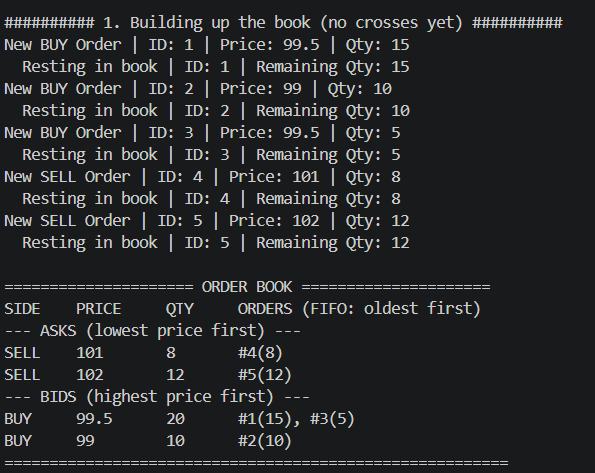
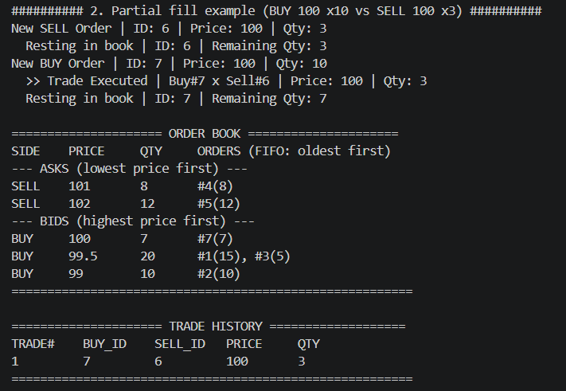
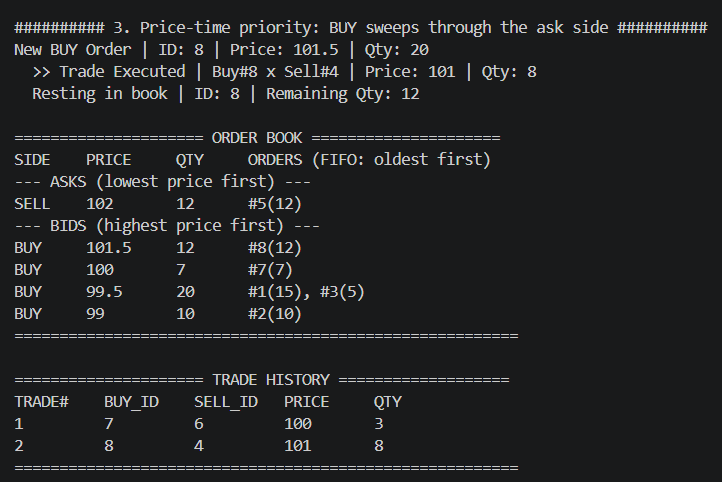
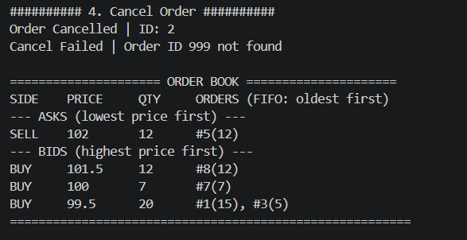
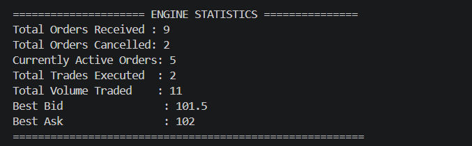

# order-matching-engine

A C++17 implementation of a stock exchange **order matching engine**, built
entirely with the STL. It simulates how real exchanges match incoming BUY
and SELL orders using **price-time priority**, and supports partial fills,
order cancellation, order modification, and full order/trade reporting.

No networking, no multithreading, no database, no GUI — this is a focused
data-structures-and-algorithms project designed to demonstrate strong STL
usage, algorithmic thinking, and clean C++ object-oriented design.

---

## Overview

At its core, an exchange order book is two priority queues — one for buyers,
one for sellers — where:

- Buyers are ranked by **highest price first**.
- Sellers are ranked by **lowest price first**.
- Orders at the *same* price are ranked by **arrival time** (FIFO).

Whenever a new order can trade against the best price on the opposite side,
it is matched immediately, generating one or more trades. Any unfilled
remainder rests in the book until it is matched or cancelled.

## Architecture

```
Order        -- immutable identity (id, side, timestamp) + mutable fill state
Trade        -- an immutable record of one execution between two orders
OrderBook    -- owns both sides of the book, the order index, and trade log
main.cpp     -- scripted demo exercising every feature end-to-end
```

`OrderBook` is the only class with real behavior; `Order` and `Trade` are
intentionally small, header-only value types so the engine's algorithmic
logic stays isolated in one place.

## Data Structures Used

| Structure | Where | Why |
|---|---|---|
| `std::map<double, std::deque<std::shared_ptr<Order>>, std::greater<double>>` | Bid ladder | Keeps price levels sorted with the best (highest) bid always at `begin()`. Red-black tree gives `O(log N)` insertion and level lookup. |
| `std::map<double, std::deque<std::shared_ptr<Order>>>` | Ask ladder | Same idea, ascending order so the best (lowest) ask is always at `begin()`. |
| `std::deque<std::shared_ptr<Order>>` | Each price level | FIFO queue: `push_back` for new arrivals, `pop_front` for the next order to match — this is what enforces **time priority** within a price level. |
| `std::unordered_map<long long, std::shared_ptr<Order>>` | Order index | `O(1)` average lookup/cancel/modify of any order by ID, independent of where it sits in the book. |
| `std::vector<Trade>` | Trade log | Append-only, read sequentially for reporting — a contiguous vector is the simplest and most cache-friendly fit. |
| `std::shared_ptr<Order>` | Everywhere | The *same* order object is referenced from both the FIFO deque and the ID index, so mutating fill state in one place (e.g. during a match) is instantly visible to the other. |

## Algorithms

**Matching (`OrderBook::matchOrder`)**
1. Look at the best opposing price level (`begin()` of the opposite map).
2. If the incoming order's price doesn't cross that level, stop — no match possible.
3. Otherwise, walk the level's FIFO deque from the front, matching the incoming
   order against each resting order in arrival order, generating a `Trade` for
   each match and reducing both orders' remaining quantity.
4. Fully-filled resting orders are popped off the front of the deque; a fully
   drained price level is erased from the map.
5. Repeat against the next best price level until the incoming order is
   either fully filled or no longer crosses the book.
6. Any leftover quantity rests in the book (`addToBook`).

**Cancellation** is a lazy, `O(1)` operation: the order's status is flipped
to `CANCELLED` in the index. It is physically unlinked from its FIFO deque
the next time that price level is traversed by the matching loop or a report
routine — this avoids an `O(N)` deque scan on every cancel.

**Modification** is implemented as cancel + re-submit at the new
price/quantity. This is deliberate and matches how real exchanges behave:
changing an order's price (or increasing its quantity) forfeits its place in
time priority.

## Complexity

| Operation | Complexity | Notes |
|---|---|---|
| Add order (no match) | `O(log N)` | One `map` insertion for the new price level (or existing level lookup) + `O(1)` `deque::push_back`. |
| Add order (matches `K` resting orders) | `O(log N + K)` | `K` resting orders fully consumed, each an `O(1)` deque pop; `N` = number of distinct price levels. |
| Cancel order | `O(1)` average | Hash lookup + status flag flip. |
| Modify order | `O(1) + O(log N + K)` | Cancel (`O(1)`) followed by an add-order (same cost as above). |
| Search order by ID | `O(1)` average | Direct `unordered_map` lookup. |
| Print order book | `O(N + M)` | `N` = price levels, `M` = total resting orders. |

## Folder Structure

```
order-matching-engine/
├── include/
│   ├── Order.h        # Order model (header-only)
│   ├── Trade.h         # Trade model (header-only)
│   └── OrderBook.h      # Matching engine interface
├── src/
│   ├── OrderBook.cpp    # Matching engine implementation
│   └── main.cpp         # Demonstration driver
├── test/
│   └── sample_input.txt # Reference order-flow scenario
├── CMakeLists.txt
├── .gitignore
├── LICENSE
└── README.md
```

## Build Instructions

Requires a C++17 compiler and CMake 3.10+.

```bash
cmake .
cmake --build .
```

This produces an executable named `order_matching_engine` in the build
directory (or the project root, depending on your CMake generator).

## Run Instructions

```bash
./order_matching_engine
```

The demo walks through: building up a resting book, a partial fill, a
multi-level sweep (price-time priority), cancellation, modification, order
search, and final engine statistics.

## Example Output

```
########## 2. Partial fill example (BUY 100 x10 vs SELL 100 x3) ##########
New SELL Order | ID: 6 | Price: 100 | Qty: 3
  Resting in book | ID: 6 | Remaining Qty: 3
New BUY Order | ID: 7 | Price: 100 | Qty: 10
  >> Trade Executed | Buy#7 x Sell#6 | Price: 100 | Qty: 3
  Resting in book | ID: 7 | Remaining Qty: 7

===================== ORDER BOOK =====================
SIDE    PRICE     QTY     ORDERS (FIFO: oldest first)
--- ASKS (lowest price first) ---
SELL    101       8       #4(8)
SELL    102       12      #5(12)
--- BIDS (highest price first) ---
BUY     100       7       #7(7)
BUY     99.5      20      #1(15), #3(5)
BUY     99        10      #2(10)
========================================================
```

Running `./order_matching_engine` end-to-end also prints a full multi-level
sweep, cancellation, modification, order search, and a final statistics
summary (total orders, cancellations, trades, volume, best bid/ask).

## Future Improvements

- **File-driven input**: parse `test/sample_input.txt`-style command files
  at runtime instead of hardcoding the scenario in `main.cpp`.
- **Order types**: market orders, immediate-or-cancel (IOC), fill-or-kill
  (FOK), and stop orders.
- **Persistence**: snapshot/replay the book and trade log to disk.
- **Eager cancellation cleanup**: an intrusive doubly-linked-list-per-level
  design would make cancellation `O(1)` *and* eager (no lazy deque scrub),
  at the cost of more manual memory management.
- **Unit tests**: a dedicated test suite (e.g. Catch2 or GoogleTest) covering
  matching edge cases, partial fills, and FIFO ordering guarantees.


  ## Demo

### 1. initial Order Book


### 2. partial Fill


### 3. pricetime Priority


### 4. cancel-order


### 5. engine-statistics

